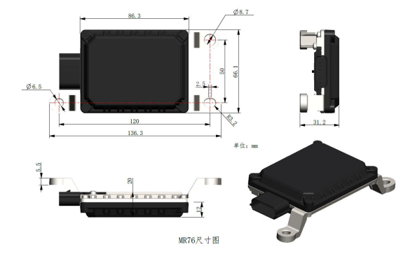
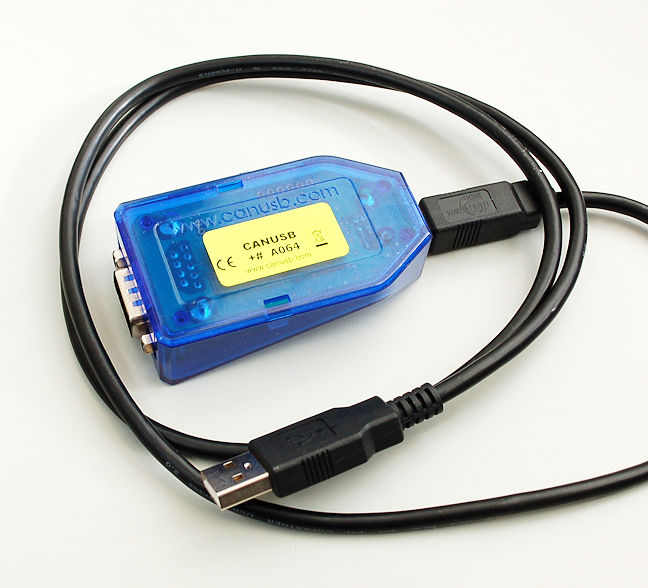

<h1 align="center">
🚀 ROS Package - MR76 NANORADAR Interface
</h1>

<p align="center">
  <a href="https://wiki.ros.org/melodic">
  
  </a>
  <a href="https://opensource.org/licenses/MIT">
  
  </a>
</p>


This ROS package provides an interface for communicating with the [MR76 NanoRadar ](https://www.nanoradar.com/products/mr76/), enabling ROS-based applications to access data from the MR76 radar sensor.

The MR76 radar outputs data over CAN, so a [CAN to Serial converter](https://www.canusb.com/products/canusb/) is required to connect to the USB of the host device.


<!-- <p align="center">
  
  
</p> -->

<div align="center">
  <div style="display: inline-block; text-align: center; margin: 20px;">
    
    <br />
    MR76 NanoRadar
  </div>
  <div style="display: inline-block; text-align: center; margin: 20px;">
    
    <br />
    CANUSB
  </div>
</div>

## Requirements

To use this package, you will need the following dependencies:
- radar_msgs
- can_msgs
- socketcan_bridge

You can install these dependencies on ROS Melodic using the following commands:

```bash
sudo apt-get install ros-melodic-radar-msgs
sudo apt-get install ros-melodic-can-msgs
sudo apt-get install ros-melodic-socketcan-bridge
```

## Installation

```bash
mkdir -p catking_ws/src
cd catking_ws/src
git clone https://github.com/your-username/radar_mr76.git
cd ..
catkin build radar_mr76
```


## Usage

1. Source your ROS workspace:

    ```bash
    source devel/setup.bash
    ```

2. Start the socketcan_bridge using the provided bash script
    ```bash
    bash src/radar_mr76/scripts/radar_can.sh
    ```

3. Start the radar node using the provided launch file
    ```bash
    roslaunch radar_mr76 radar_publisher.launch
    ```

## Configuration
You can edit the configurations in the [params.yaml](config/params.yml) file located in the config directory of this package.

## License
This ROS package is released under the [MIT License](https://choosealicense.com/licenses/mit/).

## Contact
if you have any questions or issues, feel free to contact me at
- Email: [harrylal188@gmail.com](harrylal188@gmail.com)
- LinkedIn: [Harry](https://www.linkedin.com/in/harry-lal-07583b168)
